

## Atividade 1

Nessa atividade estudaremos a representação de sistemas quânticos por meio da equação de Schrödinger, apresentada abaixo, e sua solução para alguns casos de potenciais simples, como o poço quadrado infinito e o oscilador harmonico simples; este que nos seguirá por toda a pesquisa.

$$i\hbar\cdot\frac{\partial\psi}{\partial t} = \frac{\hbar^{2}}{2m}\cdot\frac{\partial^{2}\psi}{\partial x^{2}}+V(x,t)\psi(x,t)$$

A solução apresentada no [artigo do Dr. Hashimoto](https://ieeexplore.ieee.org/document/6318710) é para o sistema do poço quadrado infinito e é suficiente para entender o processo de discretização e obtenção do resultado. Utilizando o livro base da Mecânica Quântica, por David Griffiths, utilizaremos a resposta para o oscilador harmônico juntamente dos polinômios de Hermite para modelar sua reposta analítica e usar o artigo para discretizar para o sistema OHS, portanto:

$$V(x) = 0.5mw^{2}x^{2}$$

$$\psi_n(x) = \left(\frac{m\omega}{\pi\hbar}\right)^{1/4}\cdot H_n(x)\cdot \frac{1}{\sqrt{2^nn!}}e^{0.5x^2}$$

Para modelar utilizou-se a linguagem python na plataforma jupyter e nesse primeiro momento apresenta-se a resposta analítca. Além disso, supunhou-se que $\omega = \pi$, $\hbar = 1$ e $m = 1$.

-----
Resultados no espaço
----

De acordo com a teoria proposta para a equação de Schrödinger, a solução para a equação pode ser determinada pela combinação linear de cada $\psi_n(x)$ para todo n pertencente aos naturais. Neste trabalho combinaremos a respostas em 0 e 1 com o valor constante de 0.80 e 0.60 suficiente para que a soma de seus quadrados dê 1. Abaixo estão as curvas com o polinômios de Hermite para graus maiores que 1.

 
  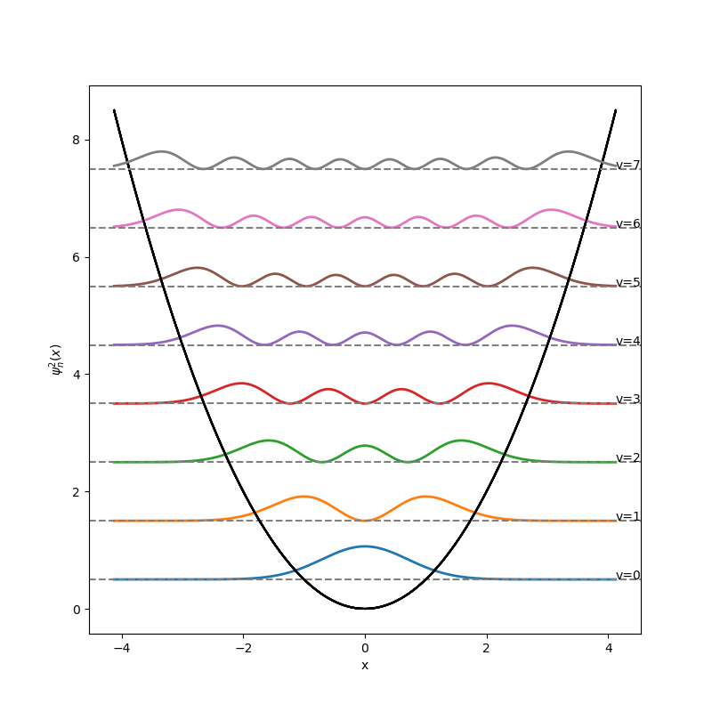
  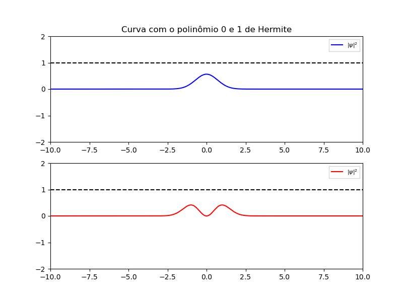
  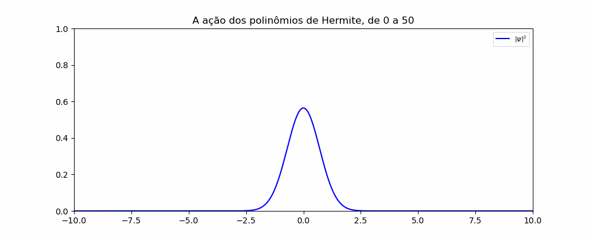

E a combinação está representada abaixo:

  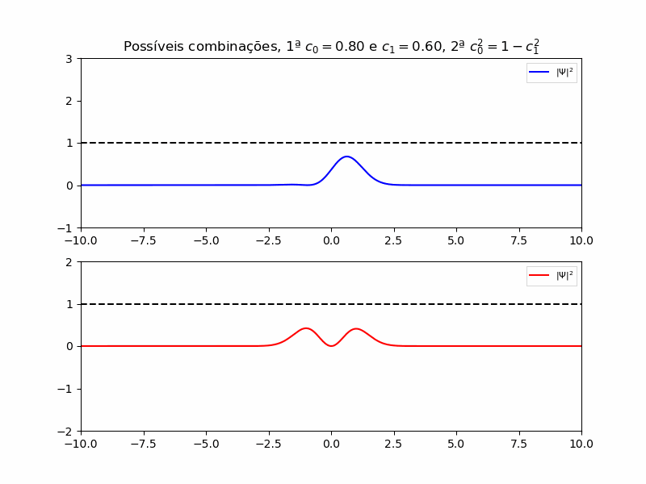

----
Resultados no tempo
----

Para concretizar e observar o resultado analítico devemos multiplicar por $e^{-i(n+1/2)\omega t}$ ambos os $\psi$'s, dessa forma obtendo uma oscilação.

  

## Atividade 2

Para a segunda atividade foi necessário entender de que forma poderia se aproximar as derivadas para facilitar a sua utilização em laboratórios de controle. Para realizar essa tarefa, utilizou-se a aproximação de derivadas pelo método de Crank-Nicolson do qual está demonstrado em um [arquivo](https://github.com/GabrielSiqueira1/MPC_Controle-Quantico/blob/main/demonstracao-CrankNicolson.pdf) pdf nesse repositório. Nesse método ocorre uma aproximação por diferenças, especificamente uma média entre a aproximação posterior e anterior de um ponto relacionado. Abaixo está um gráfico comparativo além da representação dos erros absolutos e relativos.

  

  

  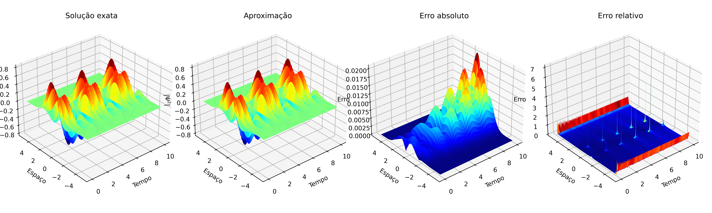

  
## Atividade 3

Para essa etapa vamos arbitrar um valor para o potencial de forma que ele seja capaz de transformar a resposta sem alterar as constantes que o regem. Perceba que isso é um teste que utilizará o método MPC de modo a minimizar os erros entre a curva atual e a ideal no fim realizando uma acumulação.

$$V(x,t) = u$$

E o objetivo é:

$$\Psi(x,0) = \Psi_0(x) -> MPC -> \Psi_d(x,t)=1/\sqrt 2(\psi_0(x)e^{-iwt/2}+\psi_1(x)e^{-3iwt/2})$$

De modo que a seguinte operação resulte no menor valor possível:

$$E = \sum_{n = p}^{p+N_h}|\Psi_d(x,t) - \Psi_{i}^{n(u)}|^{2}$$

A cada iteração, descobriremos qual é o melhor valor para u por meio de uma otimização não linear regida pela restrição da equação de Schrödinger. P, indicado pelo somatório é o ponto de partida do horizonte analisável. Para a primeira etapa seguiremos com o horizonte de tamanho 2, dessa forma, p começa em 0 e irá até 2 e na próxima iteração, começaremos em 1 até 3, sempre acumulando o  resultado anterior.

É uma análise custosa por causa da proposta inicial, a matriz 1000x1000. Para isso, fora realizado testes com matrizes de 100x100 até 500x500, sendo de 100x100 até 400x400 utilizando o método de otimização gradiente e a matriz 500x500 utilizou-se da otimização da biblioteca sympy com o método SLSQP.

Com gradiente:

  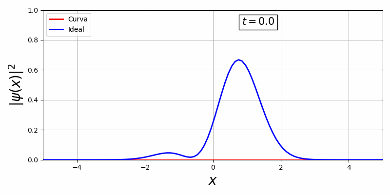

  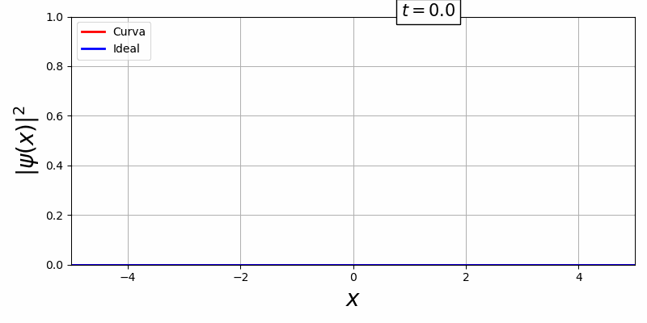

Com a biblioteca, em primeiro temos uma curva estacionária e em segundo, uma curva que há movimento temporal:

  

  

Existe uma dificuldade de controlar essa curva visto que o V(x,t) oferece pouquissímos graus de liberdade para o controle ótimo, além disso há uma representação da curva em função do tempo e espaço o que é inviável pois o espaço de solução é R.

Para contornar esse problema recorremos a representação de Heisenberg, que retira a contribuição espacial e relaciona energia de estado. O problema que incialmente era uma matriz RxR se torna 2x2, afinal, são dois estados de energia.

$$\frac{\partial}{\partial t}\Psi = -\frac{iH}{\hbar}\Psi$$

Ademais, é necessário transportar essa equação para a notação de bras e kets utilizada em controle, computação e mecânica quântica moderna.

### Ket e Bras - Controle Quântico

$$\frac{\partial}{\partial t}\\ket{\Psi} = -\frac{iH}{\hbar}\\ket{\Psi}$$
    
### Resposta analítica
    
Para a equação acima, a solução analítica se da por $\\ket{\Psi(t)} = e^{\frac{-iHt}{\hbar}}\\ket{\Psi_0}$, onde H é um hamiltoniano, então teremos uma exponencial matricial, que deve ser resolvida por polinômio de Taylor. O Hamiltoniano abaixo foi desenvolvido a partir do livro do [Professor Piza (2003)](https://www.fisica.net/mecanica-quantica/mecanica_quantica_por_a_f_r_de_toledo_piza.pdf).
    
$$H_0 = 
\left(\begin{array}{cc} 
0 & 0\\ 
0 & (\frac{-3i\pi t}{2} - \frac{-i\pi t}{2})
\end{array}\right)$$
    
Outro hamiltoniano possível é aquele em que as energias ficam na diagonal principal, dessa forma, obtemos:
    
$$H_0 = 
\left(\begin{array}{cc} 
\frac{-i\pi t}{2} & 0\\ 
0 & \frac{-3i\pi t}{2}
\end{array}\right)$$
    
Portanto, os gráficos abaixo revelam o resultado da equação $\\ket{\Psi(t)} = H_0\\ket{\Psi_0} = \\ket{\Psi(t)} = H_0(0.80\cdot\\ket 0 + 0.60\cdot\\ket 1)$, real e imaginário.

Real

  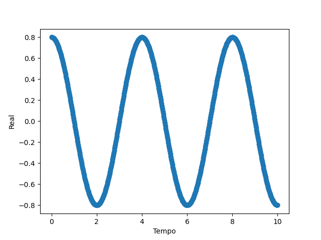

  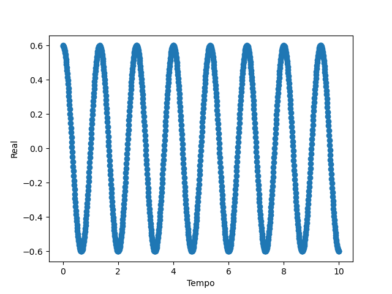

Imaginário

  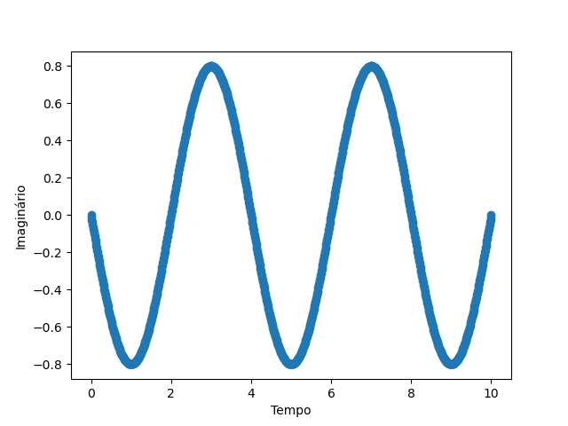

  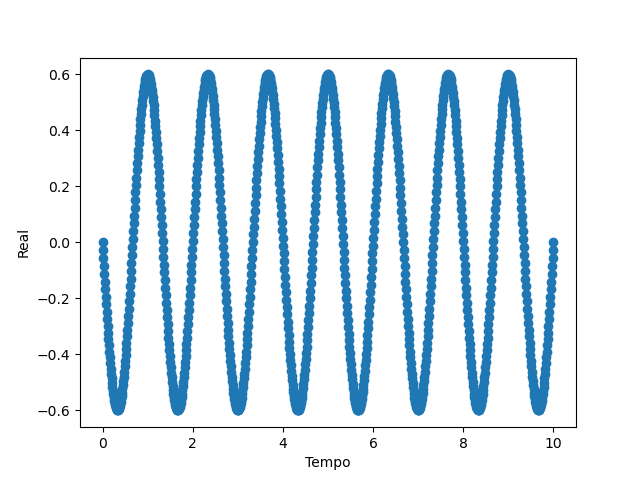

    
O objetivo do controle é reduzir essa oscilação e tornar constante o valor para que alcansemos outro estado. No entanto, o processo analítico não é replicável em laboratório, dessa forma, devemos usar aproximações para a derivada. No arquivo Heisenberg-Euler-Runge_Kutta estabelece uma comparação entre os métodos e o Runge Kutta de quarto grau é o ideal para o avanço do trabalho.
    

Real

  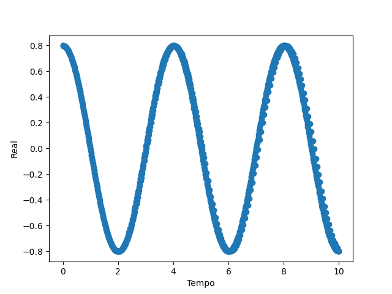

    

  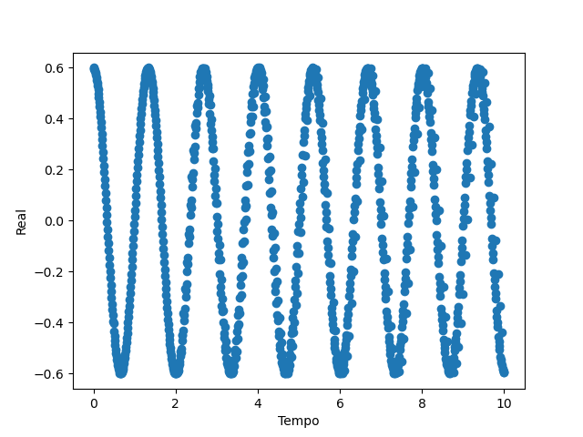

    

Imaginário

  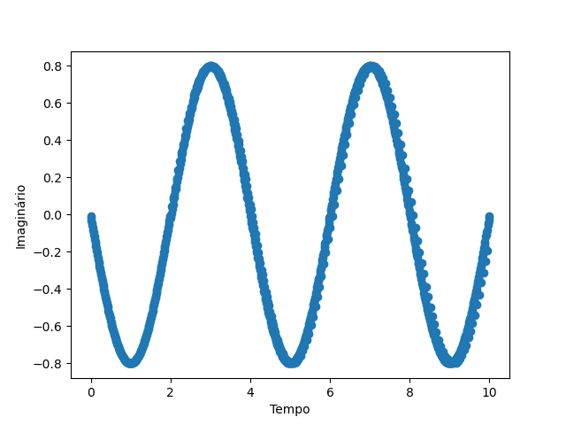

  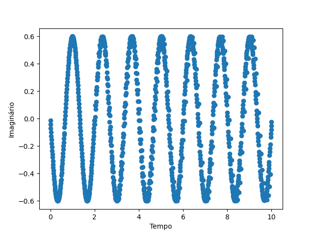

### Controle quântico
    

    

