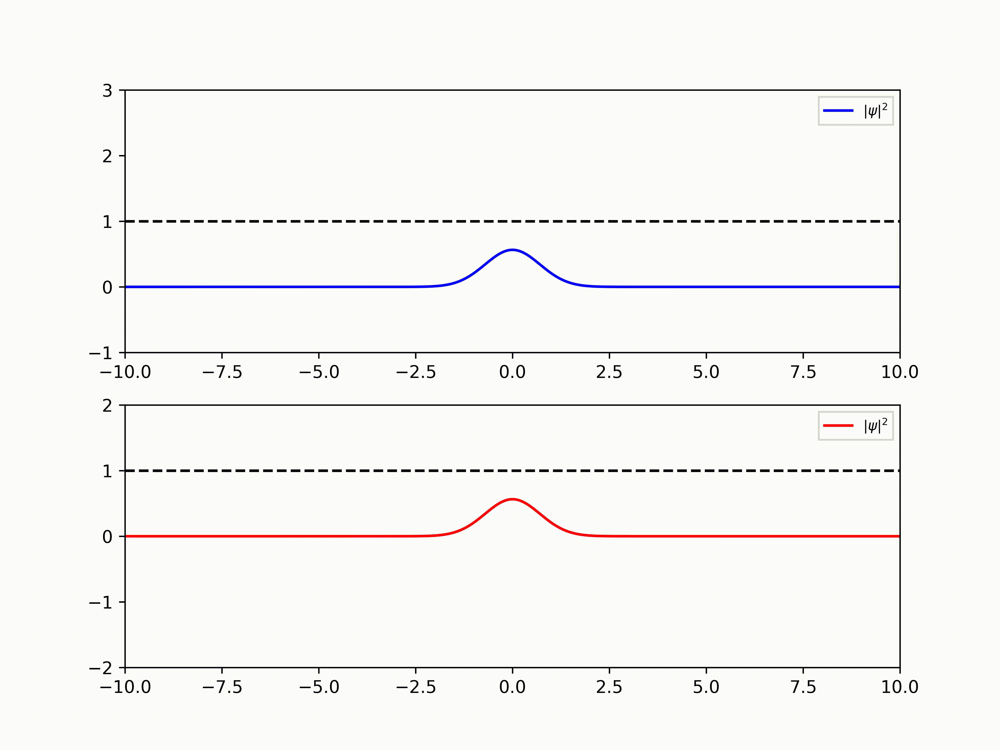
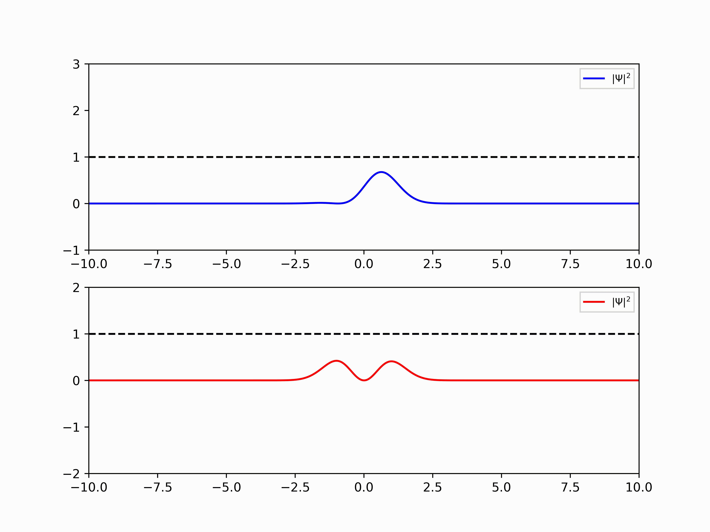
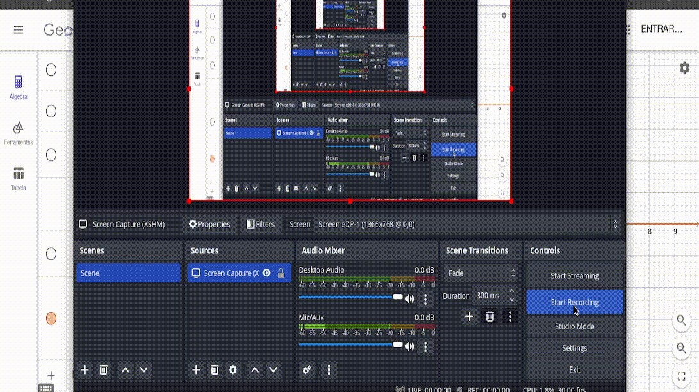
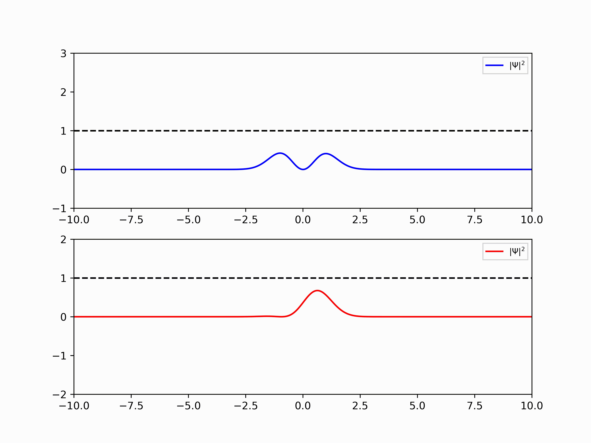

# MPC-Quantum-Computing
Esse projeto usa MPC (Modelo de controle preditivo) juntamente com o controle quântico para manipulação da função de onda apresentada na equação de Schrodinger, a base para mecânica quântica

Para realizar tal procedimento, é utilizado a linguagem Python no projeto Jupyter. 

---

## Atividade 1

### Projeção das soluções - Invariante no tempo

O objetivo dessa atividade é desenvolver gráficos referentes a solução da equação de Schrodinger e em um primeiro momento foi desenvolvido para a solução usando polinômios de Hermite.

Para que seja possível utilizar tal solução, considerou-se um sistema massa mola, ou seja, um oscilador harmônico simples $V(x)=m\cdot\omega^{2}\cdot x²/2$

Na imagem abaixo é apresentado a solução para os polinômios 0 e 1, sua complementação está disposto no projeto .ipynb.

  

Afim de mostrar a transação entre os polinômios de Hermite, construiu-se o gráfico em vermelho, mostrando todas as posições até o polinômio de grau 50.

   

Para análise completa, recomenda-se visitar o projeto .ipynb.

Ainda nessa etapa estamos considerando a equação de Schrodinger invariante no tempo, e conforme visto em Mecânica Quântica, a solução da equação pode ser vista com a combinação linear das soluções da função de onda, nesse caso, as de grau 0 e 1. Quando realizamos as possíveis combinações lineares é conseguimos ver a transição de uma função de onda à outra conforme abaixo:

   

### A variação no tempo

Para compor a resposta e representar a variação no tempo podemos multiplicar cada fator achado por $e^{-iE_nt/\hbar}$ e conforme disposto no projeto, a solução concebida variará em x conforme o gráfico e em t ocorrerá uma manipulação acreditando que a equação esteja certa. Abaixo, no geogebra, está a manipulação de várias variáveis deixando x fixo. Em p temos a correspondência de t enquanto a e b representam os fatores que realizam a combinação linear das funções de onda.

   

Foi percebido que p não acarreta variações nas soluções individuais porém na combinação linear basta uma única variação que ocorre a alteração da curva. Abaixo se tem, em python, duas curvas, a primeira com a manipulação do tempo de 0 até 10 unidades de tempo juntamente com a variação dos valores das constantes que realizam a combinação linear, e dessa forma podemos convergir o seu resultado junto ao Geogebra, e a segunda curva tem as constantes da combinação linear fixas, 0.8 e 0.6.

   

### Método de Crank-Nicolson

A prova está apresentada em latex neste mesmo repositório. Veja que a demonstração é diferente da comum, esta seguiu os resultados obtidos pelo pesquisador Dr. Hashimoto T. em 2012. A demonstração do funcionamento do método se separa nos métodos da diferenças finitas, a aproximação de derivadas com a série de Taylor, o Euler explícito e implícito, a Representação Álgebrica e a solução em estado estático.
