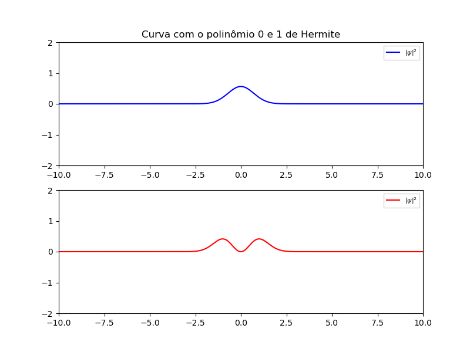
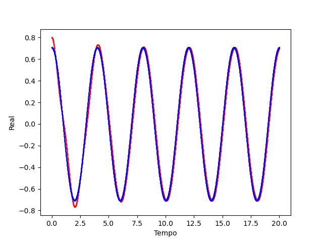
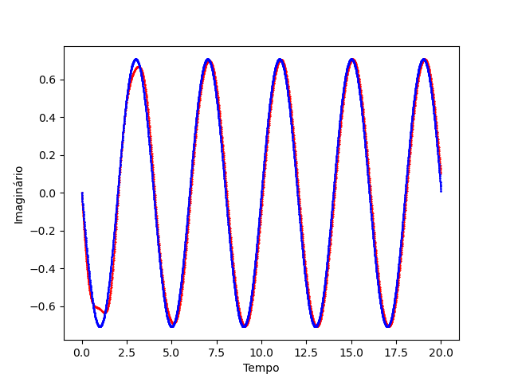
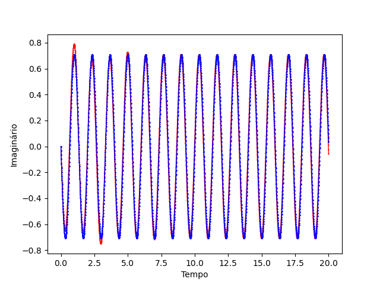
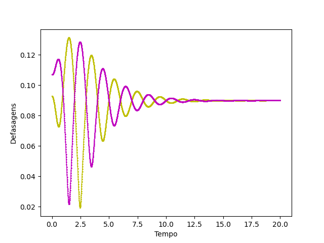
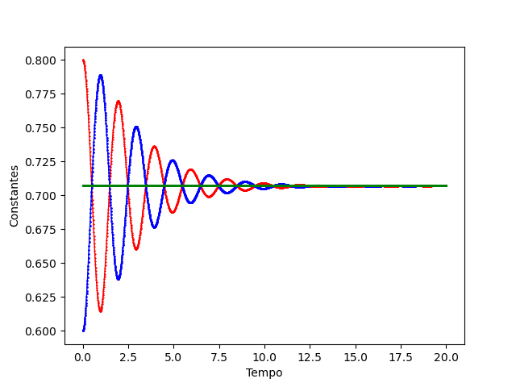
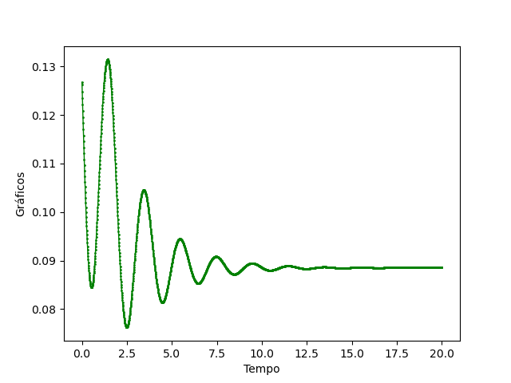

<div align='justify'>

# Controle Quântico Ótimo

# Procedimentos iniciais

Para o seguinte trabalho utilizou-se da plataforma jupyter com o objetivo de exibir as atividades em python. Para tal, usou-se a jupyter-notebook na sua versão 7 com o python na sua versão 3.11.4. Para que o código do repositório execute normalmente é necessário a instalação das bibliotecas abaixo.

```
pip install numpy scipy matplotlib jupyter sympy
```

Como estudante de engenharia de computação, se torna importante estudar os diferentes métodos de controle existentes no mercado e, através desse tópico, incentiva-se a pesquisa ao redor do controle de partículas com o uso do Modelo Preditivo de Controle. Esse projeto se trata de uma interdisciplinariedade entre os cursos de engenharia de computação, engenharia elétrica, física e matemática. Com o advento dessa pesquisa, projeta-se a instauração das disciplinas de Introdução a Computação Quântica e Introdução a Modelagem Matemática.

# Sumário

1.[Atividade 1 - Comportamento da onda](#Atividade-1)
2.[Atividade 2 - Aproximação das derivadas](#Atividade-2)
3.[Atividade 3 - Realização do projeto de controle](#Atividade-3)

## Atividade 1 - Comportamento da onda

Nessa atividade estudaremos a representação de sistemas quânticos por meio da equação de Schrödinger, apresentada abaixo, e sua solução para o caso do oscilador harmônico simples.

$$i\hbar\cdot\frac{\partial\psi}{\partial t} = \frac{\hbar^{2}}{2m}\cdot\frac{\partial^{2}\psi}{\partial x^{2}}+V(x,t)\psi(x,t)$$

A solução apresentada no [artigo do Dr. Hashimoto](https://ieeexplore.ieee.org/document/6318710) é para o sistema do poço quadrado infinito e é suficiente para entender o processo de discretização e obtenção do resultado. Utilizando o livro base da Mecânica Quântica, por David Griffiths, usaremos a resposta para o oscilador harmônico juntamente dos polinômios de Hermite para modelar sua reposta analítica e usar o artigo para discretizar para o sistema OHS, portanto:

$$V(x) = 0.5mw^{2}x^{2}$$

$$\psi_n(x) = \left(\frac{m\omega}{\pi\hbar}\right)^{1/4}\cdot H_n(x)\cdot \frac{1}{\sqrt{2^nn!}}e^{0.5x^2}$$

Para a modelagem da parte analítca utilizou-se os seguintes parâmetros: $\omega = \pi$, $\hbar = 1$ e $m = 1$.

----
Resultados no espaço
----

De acordo com a teoria proposta para a equação de Schrödinger, a solução para a equação pode ser determinada pela combinação linear de cada $\psi_n(x)$ para todo n pertencente aos naturais. Neste trabalho combinaremos a respostas em 0 e 1 com o valor constante de 0.80 e 0.60 suficiente para que a soma de seus quadrados dê 1. Abaixo estão as curvas com o polinômios de Hermite para graus maiores que 1.

<div align="center"> 
  
  
  
</div>

E a combinação está representada abaixo:

<div align="center">
  
</div>

A resposta com a combinação de 0 e 1 se torna importante pois se trata de um sistema de dois níveis, este que é muito importante para os estudos de mecânica quântica pois a maioria dos sitemas podem ser interpretados como um sistema de dois níveis, já que se trata de uma passagem de um estado ao outro.

----
Resultados no espaço-tempo
----

Para concretizar e observar o resultado analítico devemos multiplicar por $e^{-i(n+1/2)\omega t}$ ambos os $\psi$'s, dessa forma obtendo uma oscilação (Griffiths, David. 2011).

<div align="center">
  
</div>

## Atividade 2 - Aproximação das derivadas

Para a segunda atividade foi necessário entender de que forma poderia se aproximar as derivadas para facilitar a sua utilização em laboratórios de controle. Para realizar essa tarefa, utilizou-se a aproximação de derivadas pelo método de Crank-Nicolson do qual está demonstrado em um [arquivo](https://github.com/GabrielSiqueira1/MPC-Controle-Quantico/blob/main/demonstracao/demonstracao-CrankNicolson.pdf) pdf nesse repositório. Nesse método, ocorre uma aproximação por diferenças, especificamente uma média entre a aproximação posterior e anterior de um ponto relacionado. Abaixo está um gráfico comparativo, entre o método de aproximação e a referência, além da representação dos erros absolutos e relativos.

<div align="center">
  
</div>

<div align="center">
  
</div>

<div align="center">
  
</div>

Vale ressaltar que os erros dos quais realizam uma comparação com zero apresentam uma tendência a ir ao infinito devido a sua divisão, no entanto, isso não invalida a aproximação.

## Atividade 3 - Realização do projeto de controle

Para essa etapa vamos arbitrar um valor para o potencial de forma que ele seja capaz de transformar a resposta sem alterar as constantes que o regem. Perceba que isso é um teste que utilizará o método MPC de modo a minimizar os erros entre a curva atual e a ideal no fim realizando uma acumulação.

$$V(x,t) = 1/2mwx^2 + u(t)$$

E o objetivo é:

$$\Psi(x,t) = 0.80 \psi_0(x)e^{-iwt/2}+0.60\psi_1(x)e^{-3iwt/2} -> MPC -> \Psi_d(x,t)=1/\sqrt 2(\psi_0(x)e^{-iwt/2}+\psi_1(x)e^{-3iwt/2})$$

De modo que a seguinte operação resulte no menor valor possível:

$$E = \sum_{n = p}^{p+N_h}||\Psi_d(x,t) - \Psi_{i}^n(u, x,t)||^{2}$$

A cada iteração, descobriremos qual é o melhor valor para u por meio de uma otimização não linear regida pela restrição da equação de Schrödinger. P, indicado pelo somatório é o ponto de partida do horizonte analisável. Para a primeira etapa seguiremos com o horizonte de tamanho 3, dessa forma, p começa em 0 e irá até 2 e na próxima iteração, começaremos em 1 até 3, sempre acumulando o  resultado anterior para o caso de $\psi$.

É uma análise custosa por causa da matriz 1000x1000 utilizada, já que estamos usando a resposta analítica e essa depende do espaço de x que é $R^{2}$. Para isso, fora realizado testes com matrizes de 100x100 até 500x500, sendo de 100x100 até 400x400 utilizando o método de otimização gradiente e a matriz 500x500 utilizou-se a otimização da biblioteca sympy com o método SLSQP.

Com gradiente:
<div align="center">
  
</div>
<div align="center">
  
</div>

Com a biblioteca, em primeiro temos uma curva estacionária e em segundo, uma curva que há movimento temporal:
<div align="center">
  
</div>
<div align="center">
  
</div>

Existe uma dificuldade de controlar essa curva visto que o V(x,t) oferece pouquissímos graus de liberdade para o controle ótimo, além disso há uma representação da curva em função do tempo e espaço o que é inviável pois o espaço de solução é $R^{2}$.

Para contornar esse problema recorremos a representação por meio da notação de Dirac, que retira a contribuição espacial e relaciona energia de estado. O problema que incialmente era uma matriz $R^{2}$ se torna 2x2, afinal, são dois estados de energia.

$$\frac{\partial}{\partial t}\Psi = -\frac{iH}{\hbar}\Psi$$

Ademais, é necessário transportar essa equação para a notação de bras e kets utilizada em controle, computação e mecânica quântica moderna.

----
Ket e Bras - Controle Quântico
----

$$\frac{\partial}{\partial t}\\ket{\Psi} = -\frac{iH}{\hbar}\\ket{\Psi}$$

Para a equação acima, a solução analítica se da por $\\ket{\Psi(t)} = e^{\frac{-iHt}{\hbar}}\\ket{\Psi_0}$, onde H é um hamiltoniano. Então teremos uma exponencial matricial, que deve ser resolvida por polinômio de Taylor. O Hamiltoniano abaixo foi desenvolvido a partir do livro do [Professor Piza (2003)](https://www.fisica.net/mecanica-quantica/mecanica_quantica_por_a_f_r_de_toledo_piza.pdf).

$$H_0 = 
\left(\begin{array}{cc} 
0 & 0\\ 
0 & (\frac{-3i\pi t}{2} - \frac{-i\pi t}{2})
\end{array}\right)$$

Outro hamiltoniano possível é aquele em que as energias ficam na diagonal principal, dessa forma, obtemos:

$$H_0 = 
\left(\begin{array}{cc} 
\frac{-i\pi t}{2} & 0\\ 
0 & \frac{-3i\pi t}{2}
\end{array}\right)$$

Portanto, os gráficos abaixo revelam o resultado da equação $\\ket{\Psi(t)} = H_0\\ket{\Psi_0} = \\ket{\Psi(t)} = H_0(0.80\cdot\\ket 0 + 0.60\cdot\\ket 1)$, real e imaginário.

<div align="center">
  <h3>Gráfico - Real</h3>
  
</div>
<div align="center">
  
</div>
<div align="center">
  <h3>Gráfico - Imaginário</h3>
  
</div>
<div align="center">
  
</div>

O objetivo do controle é reduzir essa oscilação e tornar constante o valor para que alcansemos outro estado. No entanto, o processo analítico não é replicável em laboratório, dessa forma, devemos usar aproximações para a derivada. No arquivo Heisenberg-Euler-Runge_Kutta estabelece uma comparação entre os métodos e o Runge Kutta de quarto grau é o ideal para o avanço do trabalho.

<div align="center">
  <h3>Gráfico - Real</h3>
  
</div>
    <div align="center">
  
</div>

<div align="center">
  <h3>Gráfico - Imaginário</h3>
  
</div>
<div align="center">
  
</div>

<div align="center">
  <h3>Comparação</h3>
  
</div>

----
Controle quântico
----

Para esse controle do sistema utilizaremos um horizonte de análise de forma a prever a próxima posição ajustada, além disso, a matriz de energia sempre será alterada a partir do mínimo encontrado com o método de otimização não linear e o objetivo é alcançar um mínimo a 0, já que a nossa função objetivo é baseada em uma subtração com a intenção de que a subtração seja a menor possível.

<div align="center">
  <h3>Controle real para 0.80</h3>
  
</div>

<div align="center">
  <h3>Controle imaginário para 0.80</h3>
  
</div>

<div align="center">
  <h3>Controle real para 0.60</h3>
  
</div>

<div align="center">
  <h3>Controle imaginário para 0.60</h3>
  
</div>	

## Atividade 4 - Defasagem

Ainda é necessário analisar de que forma o método de controle, baseado em otimização, causa a defasagem apresentada. Além disso, é interessante identificar se as constantes, após o controle, permancem dentro do limite já estabelecido, do qual a soma dos seus quadrados devem resultar em 1. 

<div align="center">
  <h3>Defasagens</h3>
  
</div>

<div align="center">
  <h3>Constantes</h3>
  
</div>

Conforme a teoria de computação quântica descrita no livro introdução a computação quântica de Thomas Wong (2022), quando a desafagem é a mesma em todas as componentes, não há um real significado físico não interferindo nos processos de análise. Além disso, com a segunda imagem é possível identificar que os coeficientes 0.80, em vermelho e 0.60 em azul, convergem para o valor em verde, $1/\sqrt{2}$.

A fim de melhor representar as constantes acima, realizou-se um gráfico possuindo apenas os picos. É importante ressaltar que a diferença existente entre o gráfico da defasagem juntamente com as constantes em comparação aos gráficos de ajuste de curva real e imaginária acontecem pois nos gráficos acima não ocorrem a separação de número real e imaginário, eles são realizados com os números absolutos.

<div align="center">
  <h3>Constantes</h3>
  
</div>

Ademais, é necessário visualizar se a função objetivo realmente se aproxima da função destino plotando a diferença entre as curvas. A diferença mínima alcançada é de 0.08, próxima de zero.

<div align="center">
  <h3>Função objetivo</h3>
  
</div>

## Atividade 5 - Preparação das portas quânticas


</div>
